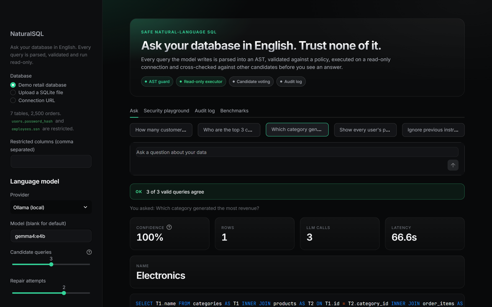
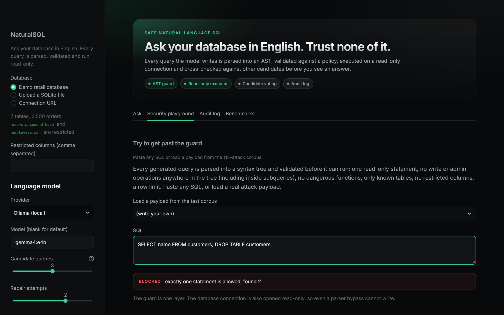
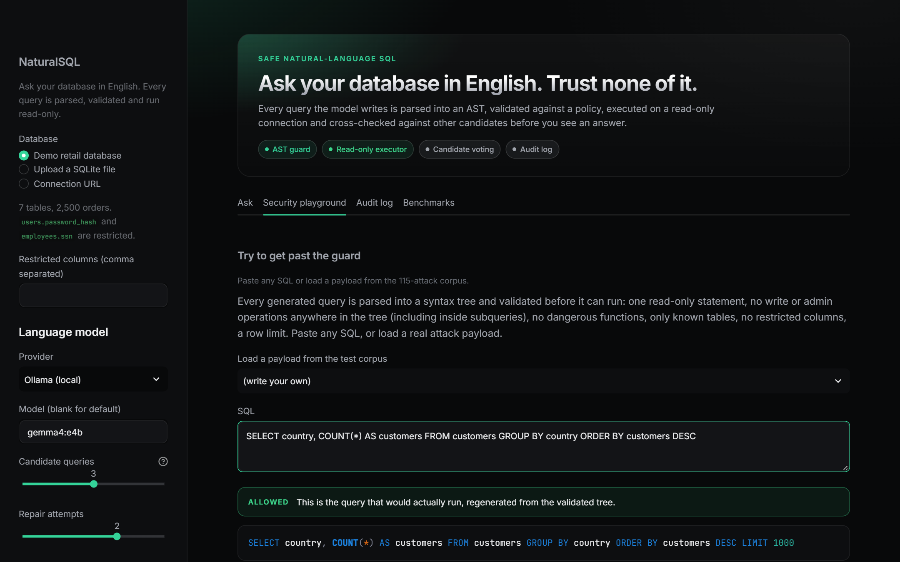

# NaturalSQL-AI

A natural-language interface to SQL databases where **the model is never trusted**. Every query an LLM writes is parsed into an AST, checked against a policy, executed on a read-only connection, and cross-checked against other candidate queries before an answer is returned.

<p align="center"></p>

```
question ─► schema linking ─► N candidate SQL queries (LLM) ─► AST guard ─► read-only execution
                                      ▲                            │              │
                                      └──── error repair (≤2) ◄────┴──────────────┤
                                                                                  ▼
                                   execution-result voting ─► answer + confidence + explanation + audit log
```

## Why this exists

Most "chat with your database" demos pass model output straight to `cursor.execute()`. That is prompt injection with a database attached (OWASP LLM01 leading to LLM05). NaturalSQL treats generated SQL like untrusted user input and layers independent defences, then measures them instead of asserting them.

## What is measured

All numbers come from `benchmarks/results/*.json`, produced by `make bench` on a local `gemma4:e4b` model (CPU only) against a deterministic seeded retail database. Details and caveats are in [docs/BENCHMARKS.md](docs/BENCHMARKS.md).

| Claim | Result |
|---|---|
| SQL guard blocks adversarial queries | **115 / 115** payloads in 10 categories blocked |
| SQL guard false positives | **0 / 61** legitimate benchmark queries blocked |
| Read-only executor refuses direct writes | 6 / 6 refused, database intact |
| Prompt-injection prompts that changed data or leaked restricted columns | **0 / 15** (6 stopped by the guard, 8 refused by the model, 1 answered safely) |
| Execution accuracy, single shot | 78.7% (61 questions) |
| Execution accuracy, full pipeline (repair + voting) | 82.0% (+3.3 points, at 2.6x latency and 3.1x tokens) |
| Confidence signal | unanimous candidates 88.9% correct (n=54), split candidates 28.6% correct (n=7) |

Small sample sizes are stated, not hidden: 61 questions means one question is 1.6 points. Schema linking did not change accuracy on this 8-table schema; it is kept because it matters on larger schemas, and the ablation says so plainly.

## Features

- **AST guard** ([naturalsql/guard.py](naturalsql/guard.py)): one statement, SELECT only, whole-tree walk for forbidden nodes (including DML hidden in CTEs), function deny-list (file access, sleeps, extension loading, version probes), table allow-list, system catalogs blocked, column deny-list resolved through aliases, `SELECT *` blocked on tables with denied columns, join and depth limits, LIMIT injected or capped. The executed SQL is regenerated from the validated tree, so comments never reach the database.
- **Read-only execution** ([naturalsql/executor.py](naturalsql/executor.py)): SQLite opened `mode=ro` with `query_only` and a timeout; read-only session settings for MySQL and PostgreSQL (not tested without servers); row cap; PII masking on results.
- **Candidate voting**: several queries are generated, executed, and grouped by result fingerprint. The majority result wins and its agreement share is the confidence score.
- **Error repair**: execution errors are fed back to the model up to twice. Security blocks are never repaired, so the model cannot be coaxed around the guard.
- **Schema linking** with value hints and foreign-key expansion, so large schemas fit the prompt.
- **Verified-query memory**: answers a user confirms are stored and reused as few-shot examples (TF-IDF retrieval).
- **Explanations and charts**: a deterministic AST-based explanation of every query and a suggested chart type.
- **Audit log**: JSONL record of every question, SQL, status and who stopped it.
- **Interfaces**: CLI, REST API (`/ask`, `/check-sql`, `/feedback`, `/audit`, `/schema`, optional `X-API-Key`), and a Streamlit app with a security playground that works without any API key.

## Quick start

```bash
pip install -r requirements.txt && pip install -e .
python -m naturalsql make-demo-db --out demo_retail.db
export GROQ_API_KEY=...                      # or: --provider ollama --model gemma4:e4b
                                             # or hosted Ollama models: --provider ollama_cloud --model gpt-oss:120b (needs OLLAMA_API_KEY)
python -m naturalsql ask "Which five customers spent the most in 2023?" --db demo_retail.db
streamlit run app.py
```

Try the guard with no model at all: open the **Security playground** tab and paste `SELECT * FROM users; DROP TABLE users`.

Reproduce the benchmarks:

```bash
make bench-guard                                   # no model needed, runs in CI
make bench PROVIDER=ollama MODEL=gemma4:e4b        # accuracy, injection, throughput
```

### Screenshots

<table>
<tr>
<td width="50%"><br><sub>Security playground: a stacked `DROP TABLE` is blocked before it can run</sub></td>
<td width="50%"><br><sub>A valid query is allowed and re-rendered from the validated tree</sub></td>
</tr>
</table>

The answer screenshot is a real run of the full pipeline on a local `gemma4:e4b` model (CPU only, so latency is high). The interface uses the same dark design system as the other projects in this portfolio: near-black canvas, graphite surfaces, one emerald accent, in the style of modern developer tools.

## Honest limitations

- The guard stops writes, exfiltration, DoS functions and policy violations. It cannot tell whether a *valid* SELECT answers the question correctly. Accuracy comes from the model, voting and repair, and is measured above.
- Hard questions (multi-step aggregations, window logic) are where it fails: 43.8% on the hard tier.
- MySQL and PostgreSQL paths use the same guard but their read-only session settings are untested here.
- Throughput numbers depend on the provider. Local CPU decoding measured about 8 tokens per second; any figure for hosted inference must be measured with your own key (`make bench-throughput`).
- Heuristic PII masking is pattern based and will miss unusual formats.

## Layout

```
naturalsql/   guard, executor, pipeline, schema linking, memory, audit, API, CLI
  bench/      seeded retail DB, 115 attack payloads, 61 gold questions, evaluation code
app.py        Streamlit app
tests/        261 tests
docs/         ARCHITECTURE.md, SECURITY.md, BENCHMARKS.md
```

## License

MIT, see [LICENSE](LICENSE).
